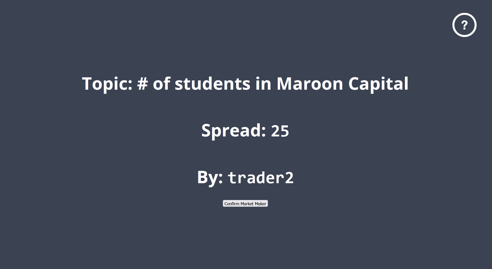
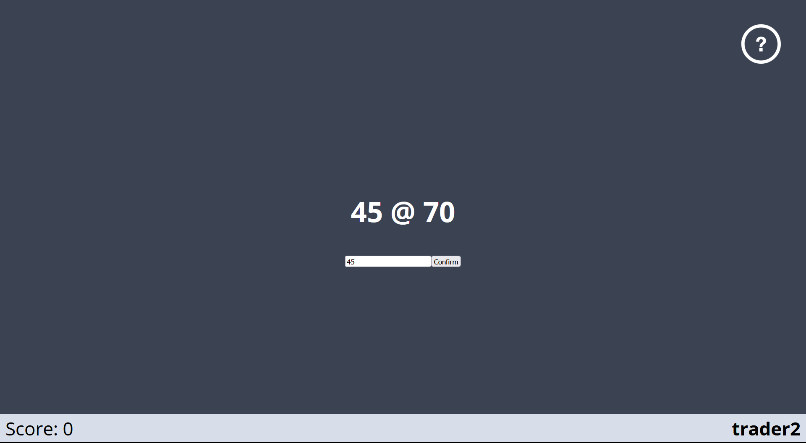
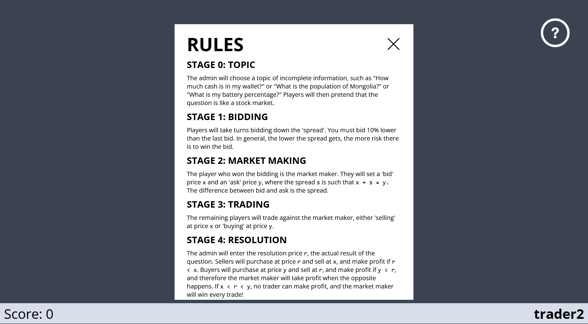

# Trader Titans

You can play the game [here](https://tradertitans.netlify.app/).

This project was inspired by trading game I played at Maroon Capital at UChicago, developed as my Winter Break 2023 project. We used an extremely clunky spreadsheet to play the game, whereas an online implementation that functions similarly to Kahoot or Quiplash would feel much smoother.

This is my first webapp I've written, much of the code should be refactored, and some of the game/server communication is somewhat clunky, but should be fixed relatively soon. Similarly, the graphics of this game are very much in progress.





## Links
- Live Deployment via Heroku (server side) and [Netlify](https://tradertitans.netlify.app/)

## Project Details
This project is built with

- [React](https://reactjs.org)
- [Styled Components](https://styled-components.com)
- [Socket.IO](https://socket.io)


## Available Scripts

This project was bootstrapped with [Create React App](https://github.com/facebook/create-react-app). Anything scripts you can run there you can run here.


## client setup

Navigate to the folder where the project is downloaded and install packages with

```
npm install
```

Then, in the project directory, you can run:

```
npm start
```

Runs the app in the development mode.

Open [http://localhost:3000](http://localhost:3000) to view it in your browser.

## admin setup

Navigate to the server directory. By default, nodemon is used, and runs on port 4000. Then run the following to install and start the server.

```
cd server
npm install
npm start
```

## things still left to implement

- change logic for when players do not trade - reduce their score by min(-0.5*spread, playerScoreDifference)
- write further error messages for within the admin/game components
- better graphics
- picture on loading screen
- dynamically scale question screen
- if market maker disppears before they set bid/ask, what do you do? You can resolve early, but that penalizes every player that doesn't get to trade, while nothing happens to market maker? Resolving before market maker sets line also results in market maker's scoreboard being NaN, until they refresh and grab serverdata
- server screen, showing rooms and statuses
- refactor some stuff
    - variables need renaming
    - a few legacy variables might be floating around
- redesign the way event hooks are used
- winner screen, not just the leaderboard, but show all scores after game ends
- mobile support, larger buttons and input screens
- don't just put everything in the center of the screen
- custom toasts(?) for aesthetics
- add error for missing room name when someone tries to create room

## known bugs
- if a player gets kicked from the room, and they start a room with the same code, they will be sent to the player screen instead of the admin screen
